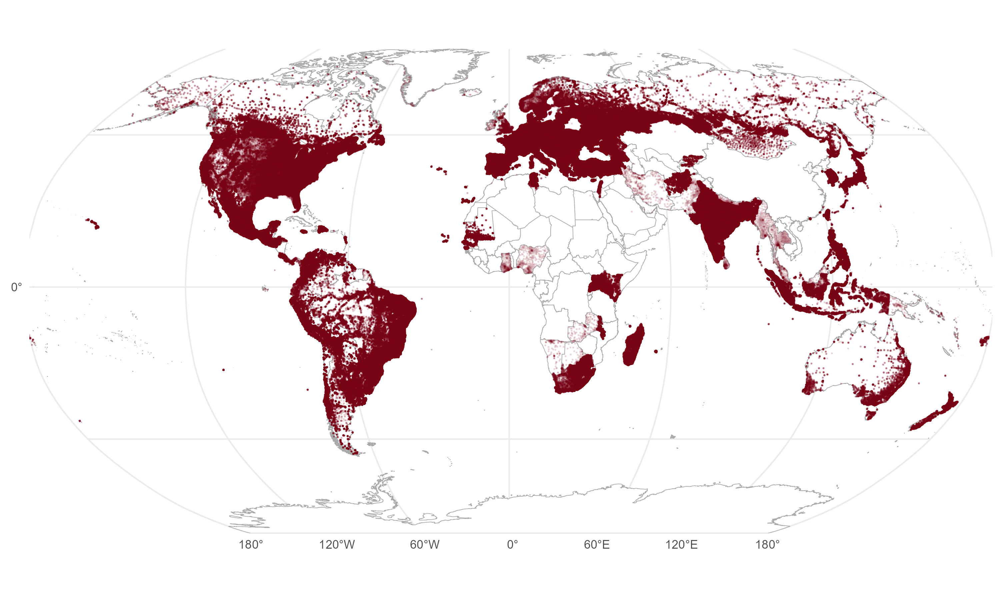

# Small-Area Global Elections (SAGE) Archive

Monitoring the construction of SAGE, the small-area global elections database, providing small-area election results with polygon geometry for national elections.

## Table of Contents
- [Introduction](#introduction)
- [Change Log](#change-log)
- [Usage](#usage)
- [Progress](#progress)
- [Country Coverage](#country-coverage)
- [Acknowledgements](#acknowledgements)

## Introduction

SAGE is a comprehensive database of geocoded, small-area (polling station, municipality, or equivalent) election results for national elections worldwide

## Change Log

#### v0.86 (May 6th, 2025)
- Added registered voter turnout in the United States for 2012 to 2020
  
#### v0.85 (April 5th, 2025)
- Redid all of the United States; presidential results only from 2008 to 2024 (last year missing several states)

#### v0.81 (March 24th, 2025)
- Redid all of Greece from scratch, and added 2023 elections
- LSAGE: added local election results for Poland

#### v0.80 (March 17th, 2025)
- Added registered/eligible voter counts to elections in: Canada, Denmark, Finland, Hungary
- Corrected issues with Norwegian vote count numeric conversion 
- Re-geocoded 2021 Albanian legislative elections with Google instead of ESRI
- Manually corrected coordinates of several Argentine polling stations
- Corrected source for French municipal boundaries <= 2017
- LSAGE: added local election results for Spain and Norway

### v0.78 (March 12th, 2025)
- Changed party columns corresponding to candidates in Myanmar to candidate columns
- Various party and NAME fixes in Madagascar, Uruguay, Honduras
- Corrected duplicate party tallies in Belgium
- Added month information to Greek snap elections 
- Added geometry to all election years in Norway

### v0.75 (February 4th, 2025)
- Added turnout for most Russian elections

### v0.7 (January 24th, 2025)
- Fixed Bosnia and Herzegovina Thiessen polygons to use only Republika Srpska or Federation of Bosnia and Herzegovina boundaries, rather than generation across the country at-large
- Added (incomplete) 2024 Senegalese legislative election results
- Added 2018 results for Costa Rica
- Added polling station addresses as NAME columns to Brazil and Argentina
- Changed party columns corresponding to candidates in Afghanistan, Botswana, Dominica, Ghana, Italy, Lesotho, Malaysia, and Thailand to candidate columns
- Corrected Afghan, Croatian, and Italian party names
- Added geometry to 2021 and 2024 Russian elections
- Fixed strange nested list state of Argentine geometry column
- Added actual section ("polling station" equivalent) boundaries to all Spanish elections from 2004 onwards
- Added 2014 to 2022 parliamentary and presidential elections in Slovenia
  
### v0.6 (January 15th, 2025)
- Fixed bug in Thiessen generation code affecting polygon edges and applied fix to all 67 affected countries 
- Added 2023 general election results for Spain
- Added Kenya (2022 presidential elections)
- Reduced floating point precision of Indian polling station coordinates to 1e-6, fixing errors in Thiessen polygon generation with deldir claiming non-unique points

### v0.5 (January 9th, 2025)
- Added 2024 election results for United Kingdom, Taiwan, Japan, South Korea, Portugal, Austria, Iceland, Georgia, Finland, Lithuania, Croatia, Bulgaria, Mexico, Dominican Republic, Romania, North Macedonia, France, South Africa, and Moldova
- Added 2023 Spanish general election results
- Added Polish parliamentary elections back to 1991, and presidential elections to 1990
- Added second rounds and polling station addresses/coordinates for both of the 2014, 2019 elections in Uruguay
- Re-generated Thiessen polygons for Taiwan using year-dated updated boundaries
- Corrected Ukrainian Thiessen polygons with 2019-dated country boundary

### v0.4 (January 7th, 2025)
- Added 2014 and 2018 Hungarian elections
- Fixed Croatian party coalition names
- Added polling station locations to 2020 Dominican Republic election, and 2016 election without known coordinates/polling “recinto”
- Corrected polling station boundaries for France in 2022, which were then used for the 2024 election; downgraded 2017 election to municipal boundaries only
- Added all Argentine elections between 2011 and 2023
- Corrected place names for Bangladesh
- Added geocoded Ecuadorian elections back to 2002, fixed NAME2 being set to NAME3

### v0.3 (December 20th, 2024)
- Added Icelandic presidential elections

### v0.2 (December 8th, 2024)
- Fixed overseas France geometry (meridian Thiessen issues)

### LSAGE Announcement (November 15th, 2024)
- Began data collection for LSAGE: local-level election (mayor, municipal council, etc.) returns
- Completed LSAGE data for United Kingdom, France, and Sweden

### v0.1 (September 5th, 2024)
- Fixed vote count totals for Uruguay and the Solomon Islands
- Added 2023 general elections for New Zealand

### v0.0 (August 6th, 2024)
- Initial completion of the data

## Usage

Stay tuned for further information about the release of SAGE

## Progress

## Country Coverage

| Country      | Years |  Polygon Years | Election Types | Smallest Physical Unit (Data) | Units per Year (approximate average) | Progress | Additional Source | Geographic Coverage (non-missing years) |
| :---        |    :----:   |          :---: |  :---: |:---: | :---:| :---: | :---: | ---:|
| Afghanistan | 2018, 2019 | All | Legislative | Polling Station | 20,000 |  ✅ | Colin Cookman | .999 |
| Albania | 2017, 2021 | 2021 | Legislative | Polling Station | 5,200 |  ✅ | | 1 |
| Argentina | 2011 to 2023 | 2023 | Legislative, Presidential | Polling Station | 100,000 | ✅ | | .98 |
| Armenia | 2012, 2013, 2018, 2021 | All |Legislative, Presidential | Polling Station | 2,000 | ✅ | | .999 |
| Australia   | 2004 to 2022  | All | Legislative | Polling Station | 8,000 | ✅ | | 1 |
| Austria | 1999 to 2024 | >= 2013 | Legislative | Municipality (gemeinde) |2,000 |  ✅ | | 1 |
| Bangladesh | 2018 | All | Legislative | Polling Station | 40,000 | ✅ | | .991 |
| Belgium | 2014, 2019, 2024 | All | Legislative | Municipality (gemeente) | 590 | ✅ | | 1 |
| Bhutan | 2018 | All | Legislative | Polling Station | 865| ✅ | | .999 |
| Bolivia | 2019, 2020 | All | Legislative, Presidential | Polling Station | 68,000 (geocode level: 6,600) | ✅ | | 1 |
| Bosnia and Herzegovina | 2018, 2022 | All | Legislative | Polling Station | 3,000| ✅ | | .999 |
| Botswana | 2014, 2019 | All | Legislative | Parliamentary Constituency | 57 | ✅ | | 1 |
| Brazil | 2014, 2018, 2022 | All | Legislative, Presidential | Polling Station | 93,000 |✅ | | .989 |
| Bulgaria | 2013 to 2023 | 2022, 2023 | Legislative, Presidential | Polling Station | 12,000 | ✅ | | .999 |
| Cabo Verde | 2021 | All | Presidential | Polling Station | 1,000| ✅ | | .966 |
| Canada   | 1997 to 2021 |>= 2000 | Legislative, Presidential | Polling Station | 70,000 | ✅ | | .990 |
| Colombia | 2018 | All | Legislative | Polling Station | 102,000 (ballot boxes; 11,000 unique places) | ✅ || .993 |
| Costa Rica | 2018, 2022 | All | Legislative, Presidential | Polling Station | 2,101 | ✅ | | .999 |
| Chile | 2013, 2017, 2021 | All | Legislative, Presidential | Polling Station | 90,000 (geocode level: 7,000) | ✅ | | 1 |
| Croatia | 2011 to 2024 | All | Legislative, Presidential | Polling Station | 6,100 |  ✅ | | 1 |
| Cyprus | 2001 to 2023 | All | Legislative, Presidential | Polling Station | 1,000 (geocode leve: 400) | ✅ | | 1 |
| Czechia | 2002 to 2021 | 2017, 2021 | Legislative | Election Precinct (okrsek) | 14,800 | ✅ | | .989 |
| Denmark | 2011 to 2022 | All  | Legislative | Polling Station | 1,300 |  ✅ || 1 |
| Dominica | 2019, 2022 | All | Legislative | Polling Station  |230 |  ✅ | | .986 |
| Dominican Republic | 2000 to 2024 | !(2000, 2010, 2016) | Legislative, Presidential | Polling Station |12,000 | ✅ | | .995 |
| Ecuador | 2002 to 2023 | All | Legislative, Presidential | Parish |1,220 | ✅ | | 1 |
| El Salvador | 2014, 2018 | All | Legislative, Presidential | Polling Station |1,600 | ✅ | | 1 |
| Estonia | 2015, 2019 | 2019 | Legislative | Polling Station | 500 | ✅ | | 1 |
| Fiji | 2022 | All | Legislative | Polling Station | 991 | ✅ | | 1 |
| Finland | 2011 to 2024 | >= 2015 | Legislative, Presidential | Voting Districts (2019), Municipality | 1,900 (2019); 310 (>= 2015) | ✅ | | .996 |
| France | 2002 to 2024 | All | Legislative, Presidential | Polling Station | 70,000 (> 2017); 35,000 (<=2017) | ✅ | | .95 (>= 2022); .988 (<= 2017) |
| Georgia | 2012 to 2024 | All | Legislative | Polling Station | 2,000 | ✅ | | .985 |
| Germany | 1983 to 2021 | >= 1998 | Legislative | Polling Station | 80,000 (geocode level: 11,000) | ✅ | | .989 |
| Ghana | 2012, 2016, 2020 | All | Legislative, Presidential | Parliamentary Constituency | 275| ✅ | |1  |
| Greece | 2012 to 2023 | All | Legislative | Polling Station | 20,000 | ✅ | | .973 | 
| Greenland | 2002 to 2022 | All | Legislative | Settlements | 72 | ✅ | | 1 |
| Guatemala | 2023 | All | Legislative | Polling Station | 24,000 (geocode level: 3,500) |  ✅ | | .928 |
| Guyana | 2015 | All | Legislative | Polling Station | 2,000 |  ✅ | | .999 |
| Honduras | 2021 | All | Legislative, Presidential | Polling Station | 18,300 (geocode level: 5,700)| ✅ | | 1 |
| Hong Kong | 2016, 2021 | All | Legislative | Polling Station | (2021: 650, 2016: 100) | ✅ | | 1 |
| Hungary | 2014, 2018, 2022 | All | Legislative | Polling Station | 10,000 | ✅ | | .999 |
| Iceland | 1959 to 2021 | All | Legislative, Presidential | Parliamentary Constituency | (8 < 2003, 6  >= 2003) | ✅ | | 1 |
| Indonesia | 2019 | All | Legislative, Presidential | Polling Station | 800,000 (geocode level: 80,000) | ✅ | | .997 | 
| India | 2019 | All | Legislative | Polling Station  | 867,000 | ✅ | | .944 | 
| Iran | 2017 | All | Presidential | City | 380 | ✅ | | 1 |
| Ireland | 2002 to 2020| 2016, 2020 | Legislative | Parliamentary Constituency | 40 | ✅ | | 1 |
| Israel | 2006 to 2022 | 2020, 2021 | Legislative | Polling Station | 11,000 | ✅ | | 1 |
| Italy | 1953 to 2022 | >= 2002 | Legislative | Municipality (commune) | 8,000 | ✅ | | .96 |
| Jamaica | 2007, 2011, 2016, 2020 | All | Legislative | Polling Station | 6,500| ✅ | | .965 |
| Japan | 2009, 2012, 2014, 2017, 2021, 2024 | All | Legislative | Municipality (市区町村) | 2,000 | ✅ | | 1 |
| Kenya | 2022 | All | Presidential | Polling Station | 46,000 |✅ | | .996 |
| Kosovo | 2017, 2019, 2021 | All | Legislative | Polling Station | 2,500 | ✅ | | 1 |
| Latvia | 2014, 2018, 2022 | All | Legislative | Polling Station | 2,000 | ✅ | | 1 |
| Lebanon | 2018, 2022 | All | Legislative | Polling Station | 6,800| ✅ | | .998|
| Lesotho | 2017, 2022 | All | Legislative | Parliamentary Constituency | 80 (geocode level: 10) | ✅ | | 1 |
| Lithuania | 2016 to 2024 | All | Legislative, Presidential | Precinct (apylinkės) | 2,000 | ✅ | | 1 |
| Luxembourg | 2023 | All | Legislative | Municipality (commune) | 100| ✅ | | 1 |
| Madagascar | 2018, 2023 | All | Presidential | Polling Station | 25,000 | ✅ | | .997 |
| Malaysia | 2008, 2013, 2018, 2022 | All | Legislative | Parliamentary Constituency | 222 | ✅ | | 1 |
| Malawi | 2019 | All | Legislative, Presidential | Polling Station | 11,000 | ✅ | | .997 |
| Mexico   | 1991 to 2024 | 2006, 2009, 2015, 2018, 2024 | Legislative, Presidential | Polling Station | 150,000| ✅ | Magar, 2019 (<= 2018) | .999 |
| Moldova | 2014 to 2024 | 2020, 2021, 2024 | Legislative, Presidential | Polling Station | 2,000 | ✅ | | .999 |
| Mongolia | 2021 | All | Presidential | Polling Station | 1,700 (geocode level: 350) | ✅ | | .956 |
| Montenegro | 2023 | All | Legislative | Polling Station | 1,000 | ✅ | | 1 |
| Myanmar | 2010, 2015 | All | Legislative | Parliamentary Constituency | 320 | ✅ | | .980 |
| Namibia | 2014, 2019 | All | Legislative, Presidential | Parliamentary Constituency | 120| ✅ | | 1 |
| Nepal | 2017, 2021 | All | Legislative | Parliamentary Constituency | 165| ✅ | | 1 |
| Netherlands | 2010 to 2021| All | Legislative | Polling Station | 400 (2017), 10,000 (others) | ✅ | | .999 |
| New Zealand   | 1999 to 2023  | All | Legislative | Polling Station | 5,000 | ✅ | | .999 |
| Nigeria | 2019 | All | Legislative | Parliamentary Constituency | 350 | ✅ | | 1 |
| North Macedonia | 2016, 2024 | All | Legislative, Presidential | Polling Station | 3,500 | ✅ | | .999 |
| Norway | 2009, 2013, 2017, 2021 | All | Legislative | Municipality (<= 2013), Electoral District (>= 2017) | 650 (<= 2013), 1,250 (>= 2017) | ✅ | | .993 |
| Pakistan | 2018 | All | Legislative | Polling Station | 72,000 (geocode level: 250) | ✅ | Colin Cookman | 1 |
| Panama | 2004, 2009 | All | Legislative | District (corregimiento) | 620 | ✅ | | .950 |
| Papua New Guinea | 1987 to 2017 | All | Legislative | Electorate | 100 |✅ | Wood (2019) | 1 |
| Paraguay | 2003, 2008, 2013, 2018 | All | Legislative, Presidential | Polling Station | 17,000 | ✅ | | .999 |
| Peru | 2006, 2011, 2016, 2021 | 2021 | Legislative, Presidential | Polling Station | 150,000 (<= 2016), 83,000 (2021) | ✅ | | 1 |
| Philippines | 2022 | All | Legislative, Presidential | Polling Station | 104,000 (geocode level: 50,000) | ✅ | | 1 |
| Poland | 1990 to 2023 | All | Legislative, Presidential | Polling Station | 27,000 | ✅ | | .999 |
| Portugal | 1976 to 2024 | >= 2009 | Legislative, Presidential | Parish | 4,000 | ✅ | | .997 |
| Romania | 2014 to 2024 | != 2016 | Legislative, Presidential | Polling Station | 18,500 | ✅ | | 1 |
| Russia | 2000 to 2024 | >= 2012 | Legislative, Presidential | Polling Station | 95,000 |✅ |  | 1 (2012), .893 (2016, 2018) |
| Senegal | 2024 | All | Legislative | Polling Station | 10,000 (incomplete data) | ✅ |  | .996 |
| Serbia | 2000 to 2022 | 2017 | Legislative, Presidential | Polling Station | 8,000 | ✅ | | .987 |
| Singapore | 2020 | All | Legislative | Constituency | 31 | ✅ | | 1 |
| Slovakia | 2016 to 2024 | All | Legislative, Presidential | Polling Station | 6,000 (geocode level: 1,500) | ✅ | | 1 |
| Slovenia | 2012 to 2022 | All | Legislative, Presidential | Polling Station | 3,700 | ✅ | | .995 |
| Solomon Islands | 2006, 2010, 2014, 2019 | All |Legislative | Parliamentary Constituency | 50 |✅ | Wood (2019) | 1 |
| South Africa | 2004 to 2024 | All | Legislative | Voting Districts | 20,000 | ✅ | | 1 |
| South Korea | 2002 to 2024 | >= 2007 | Legislative, Presidential | Polling Station | 13,000 to 34,000 | ✅ | | .99 |
| Spain | 1982 to 2023 | >= 2004 | Legislative | Polling Station | 36,000 | ✅ | | .998 |
| Sri Lanka | 2020 | All | Legislative | Polling Division | 150 | ✅ | | 1 |
| Sweden | 2006 to 2022 | All | Legislative | Electoral District | 6,100 | ✅ |  | 1 |
| Switzerland | 1971 to 2023 | >= 2011 | Legislative | Municipality | 2,400 | ✅ | | 1 |
| Taiwan | 1996 to 2024 | >= 2020 | Legislative, Presidential | Polling Station | 15,000 | ✅ | | .989 |
| Thailand | 2023 | All | Legislative | Parliamentary Constituency | 400 | ✅ | | 1 |
| Trinidad and Tobago | 2015, 2020 | All | Legislative | Parliamentary Constituency | 40 | ✅ | | 1 |
| Tunisia | 2014 | All | Presidential | Polling Station | 19,000 | ✅ | | .999 |
| Turkey | 2011, 2014, 2015, 2018, 2023 | All | Legislative, Presidential | Polling Station | 190,000 (geocode level: 50,000) | ✅ | | 1 |
| Ukraine | 2019 | All | Legislative, Presidential | Polling Station | 30,000 |  ✅ | | .996 |
| United Kingdom | 2005 to 2024 | All | Legislative | Parliamentary Constituency | 650 | ✅ | | 1 |
| United States of America  | 2008 to 2024  | >= 2008 | Presidential  | Precinct | 170,000 | ✅ | VEST, Joshua Metcalf, Jonathan Rodden | .999 |
| Uruguay | 2014, 2019, 2024 | All | Legislative | Polling Station | 7,200 | ✅ | | .991 |
| Vanuatu | 2002 to 2020 | All | Legislative | Parliamentary Constituency | 17 | ✅ |  | 1 |
| Venezuela | 2013 | All | Presidential | Polling Station | 40,000 | ✅ | | .991 |
| Zambia | 2021 | All | Presidential | Parliamentary Constituency | 150 | ✅ | | 1 |

## Acknowledgements

In addition to each of the sources listed, I thank Brian Engelsma for his African parliamentary constituency shapefiles, Adrian Frith for South African voting district shapefiles, and Walter Mebane and Rod Alence for 2022 Kenyan presidential election results.
