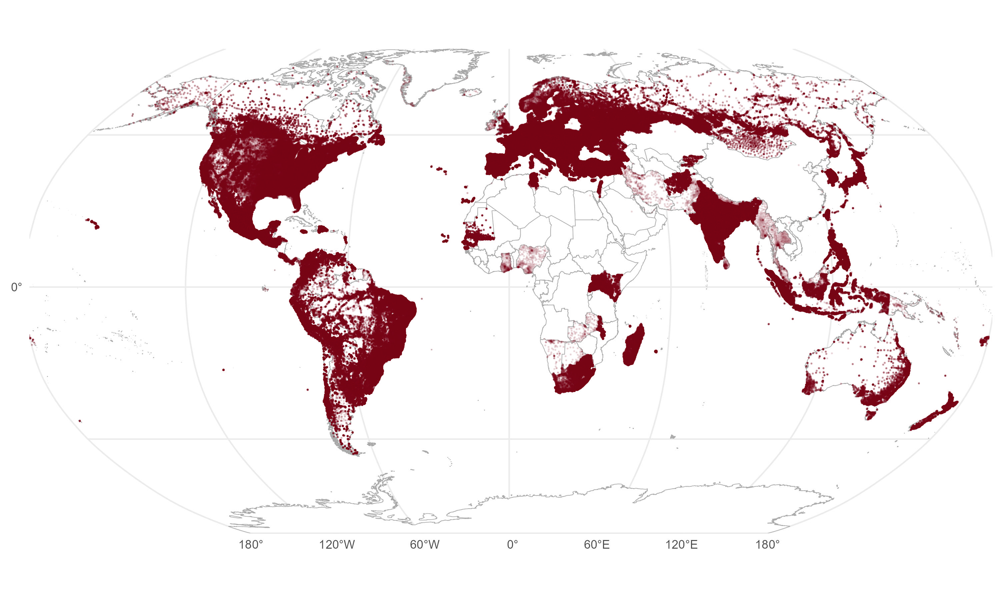

<p align="center"></p>

# Small-Area Global Elections (SAGE) Dataset

[](https://github.com/noahdasanaike/sage)
[](https://opensource.org/licenses/MIT)

Granular, geocoded, and standardized electoral returns for **134 countries**, covering more than 600 country-elections from 1948 to 2026. Each row is a (country, electoral unit, year, election type, party-or-candidate) tuple.

The [project website](https://noahdasanaike.github.io/sage.html) offers per-country downloads and an interactive map; the complete release is hosted at <https://storage.googleapis.com/sage-archive/> with anonymous read access. Two retrieval packages, one for R, and one for Python, let you pull (country, years, columns) data into your environment. A [build log](https://noahdasanaike.github.io/posts/building-sage.html) reconstructs, country by country, when each part of the dataset was actually assembled. 

---

## Citation

If you use SAGE, please cite:

> Dasanaike, Noah. “The Small-Area Global Elections (SAGE) Dataset.” Nature Scientific Data (2026).
> 
> Dasanaike, Noah. The Small-Area Global Elections (SAGE) Dataset. Harvard Dataverse, https://doi.org/10.7910/DVN/YGJR1L (2026).

---

## Please also cite

Nearly every SAGE country was scraped from scratch from official government sources, then geocoded and harmonized here. Several, though, rest on data that other researchers gathered and released first. If your analysis uses one of these countries, please cite the underlying source alongside SAGE.

**Brazil (polling-station coordinates).** As of release 1.2, SAGE uses [F. Daniel Hidalgo's geocoded Brazilian polling stations](https://github.com/fdhidalgo/geocode_br_polling_stations) as the coordinate source for every year (2014, 2018, 2022), replacing the official TSE coordinates.

**Afghanistan.** Results compiled by Colin Cookman from the Independent Election Commission: [2018 parliamentary](https://github.com/colincookman/afghanistan_election_results_2018) and [2019 presidential](https://github.com/colincookman/afghanistan_presidential_election_2019).

**Pakistan.** Polling-station data for the 2018 general election, transcribed from Election Commission of Pakistan scans by Colin Cookman and team: [pakistan_polling_stations_2018](https://github.com/colincookman/pakistan_polling_stations_2018).

**Uganda.** 2006, 2011 and 2016 polling-station results from the [Uganda Elections Data Portal](https://github.com/bt-IRI/UEDP), a project of the International Republican Institute, which converted the Electoral Commission's PDFs into machine-readable form.

**United States.** The 2024 election is built on [The New York Times' 2024 presidential precinct map](https://github.com/nytimes/presidential-precinct-map-2024), which assembled precinct returns and boundaries from state and county sources nationwide. Earlier years draw on [VEST](https://dataverse.harvard.edu/dataverse/electionscience) (Voting and Election Science Team), Joshua Metcalf, and Jonathan Rodden, as well as original collection; see also Baltz et al. under related projects below.

**Malaysia.** As of release 1.2, SAGE uses polling-district results from [ElectionData.MY](https://electiondata.my/) (Thevesh Thevananthan), which compiled them from Form 14 returns, and polling-district boundaries from Tindak Malaysia.

**Mexico.** Elections from 1991 through 2021 draw on Eric Magar's compiled returns (Magar 2019), [elecRetrns](https://github.com/emagar/elecRetrns), with coordinates added by SAGE. The 2024 election was collected directly from INE.

**Papua New Guinea and Solomon Islands.** Constituency results compiled by Terence Wood (2019).

**Russia.** Polling-station returns come from the compilations of Sergey Shpilkin and Ivan Shukshin, scraped from the Central Election Commission and distributed at [dkobak/elections](https://github.com/dkobak/elections). The Commission has never released station-level results in bulk, and has progressively closed off its results pages, so this collection is not reproducible from the official source. Station addresses used for geocoding come partly from the [GIS-Lab CIK commission directory](https://gis-lab.info/qa/cik-data.html) and the UIK GEO crowdsourcing project.

**South Africa.** Boundary files from [SA-Maps](https://github.com/j-norwood-young/SA-Maps).

**Ghana, Zambia and Botswana.** Parliamentary constituency boundaries from [Brian Engelsma's African parliamentary constituency shapefiles](https://www.brianengelsma.com/research/african-parliamentary-constituencies-shapefiles/).

**Belgium, DR Congo, Myanmar, Uruguay.** Built on openly released compilations by [José Parreiras](https://github.com/joseparreiras/resultatselection) (Belgium), [Bernard Ng'andu](https://github.com/bernard-ng/drc-election-2023) (DR Congo 2023), [Thomas Cunningham](https://github.com/thomasc6/myanmar-elections-results) (Myanmar 2015), and [ale-uy](https://github.com/ale-uy/EleccionesUy-2019) (Uruguay 2019).

---

## Related projects

SAGE is one of several efforts to make election returns comparable across places. These are worth knowing about, and in some cases are a better fit than SAGE for a given question:

**[Constituency-Level Elections Archive (CLEA)](https://electiondataarchive.org/).** Constituency-level lower- and upper-chamber results for 183 countries, reaching much further back in time than SAGE. SAGE uses this to validate country totals.

**[GERDA: The German Election Database](https://www.german-elections.com/).** Local, state and federal German results at municipality and county level over three decades, harmonized across boundary changes and mail-in districts. Much deeper on Germany than SAGE with respect to multilevel elections, with its own R package.

**[American election results at the precinct level](https://www.nature.com/articles/s41597-022-01745-0)** (Baltz et al. 2022). Nearly all available US precinct-level results for 2016, 2018 and 2020, across offices from president down to ballot initiatives. Broader in office coverage than SAGE's US returns.

**[Precinct-Level Election Data](https://dataverse.harvard.edu/dataset.xhtml?persistentId=doi:10.7910/DVN/YN4TLR)** (Ansolabehere, Palmer and Lee). US precinct-level returns by state for elections from 2002 to 2012, covering years that sit before the precinct data SAGE carries.

**[Adrian Frith](https://adrian.frith.dev/), South African election and census maps.** An interactive map of South African general election results, 2004 to 2019, drillable to voting-district level, alongside census and demarcation work.

**[elecRetrns](https://github.com/emagar/elecRetrns)** (Eric Magar). Mexican federal and state electoral returns, maintained over many years, and reaching beyond the federal races SAGE carries.

**[Electoral precinct-level database for Mexican municipal elections](https://www.nature.com/articles/s41597-025-04918-9)** (Calderón-Hernández, Larreguy, Marshall and Pérez-Castellanos 2025). Precinct-level returns for Mexican *municipal* elections, 1994 to 2019, with incumbent-coalition identifiers, registration and turnout. SAGE carries federal elections only, so this is the reference for local Mexican contests.

---

## Stay in the loop

Sign up for release notifications [here](https://docs.google.com/forms/d/e/1FAIpQLSdI-6RFTr5pq1o8HCEysohnG-58RbaP2jGUkmBFONZ-8zlkYg/viewform).

---

## Install

### R

```r
# install.packages("remotes")
remotes::install_github("noahdasanaike/sage", subdir = "sage_R")
```

The R package depends on `arrow`, `dplyr`, `tibble`, `rlang`, and (for `sage_polygons()`) `sf` + `sfarrow`.

### Python

```bash
pip install git+https://github.com/noahdasanaike/sage.git#subdirectory=sage_python
# or, when published to PyPI:
# pip install sage-elections
```

The Python package depends on `pyarrow`, `duckdb`, and `pandas`. Install the `[geo]` extra (`geopandas`, `shapely`) if you need `sage_polygons()`.

---

## Usage

```r
library(sage)

# What's available?
sage_countries()                     # 134 country names
sage_years("Germany")                # c(1998, 2002, 2005, 2009, 2013, 2017, 2021)
sage_columns()                       # the schema

# Pull a vote-row slice (no polygons; partition-pruned, returns in seconds)
de_2021 <- sage_load("Germany", years = 2021,
                     columns = c("party", "votes", "NAME3"))

# Filter on Party Facts match confidence
spain_high <- sage_load("Spain",
                        min_match_confidence = "high",
                        columns = c("party", "partyfacts_id", "votes"))

# Polygons (only when you need boundaries; one geoparquet per country)
g <- sage_polygons("Germany")
g_2020 <- sage_polygons("United States of America", years = 2020)
```

```python
import sage

sage.sage_countries()
sage.sage_years("Germany")
de_2021 = sage.sage_load("Germany", years=[2021],
                          columns=["party", "votes", "NAME3"])

# Polygons (requires geopandas)
g = sage.sage_polygons("Germany")
us_2020 = sage.sage_polygons("United States of America", years=[2020])
```

SAGE exposes per-row candidate names inline (via the `candidate` column) for 13 countries where the source publishes them at polling-station grain — including India, Pakistan, Afghanistan, Hungary, Italy, Germany Erststimme (post-2005), and a long tail of smaller systems. Coverage is partial in mixed/SMD systems (Germany ~5%, Italy ~11%, Hungary ~44%) because most rows are list-tier parties without a constituency candidate. Two countries are released as separate sidecars to keep the main parquet at (polling station, party) grain — Germany (Erststimme name & vote share per Wahlkreis × party) and the Netherlands (2021 Tweede Kamer per-stembureau preference votes); other open-list / preferential systems (Australian House, Irish/Maltese STV, Brazil, Finland, Japan SMD) are slated for follow-up releases.

```r
de_cands <- sage_preference_votes("Germany")      # 5,996 rows: (year, wahlkreis_nr, party, candidate, votes, share)
nl_pref  <- sage_preference_votes("Netherlands")  # 15M rows: per-stembureau preference votes, 2021 Tweede Kamer
```

```python
de_cands = sage.sage_preference_votes("Germany")
nl_pref  = sage.sage_preference_votes("Netherlands")
```

For SQL users, the parquet release can be queried directly via DuckDB without installing this package:

```python
import duckdb
con = duckdb.connect()
con.sql("INSTALL httpfs; LOAD httpfs;")
con.sql("""
  SELECT party, sum(votes) AS total
  FROM read_parquet(
    'https://storage.googleapis.com/sage-archive/parquet/country=Germany/**/*.parquet',
    hive_partitioning = TRUE)
  WHERE year = 2021
  GROUP BY party
  ORDER BY total DESC
""").df()
```

---

## What's in the dataset

The release lives at `gs://sage-archive/` (anonymous-read GCS bucket; same paths reachable as `https://storage.googleapis.com/sage-archive/...`):

| Subtree | Contents | Size | Use |
|---|---|---:|---|
| `parquet/` | hive-partitioned by `country` × `year`, with `_index.csv` | 1.2 GiB | most users; the R/Python `sage_load()` default |
| `zip/` | one Parquet bundle per country (votes, coordinates, party IDs; no geometry) | 1.2 GiB | per-country point-and-click download from the website |
| `polygons/` | one geoparquet per country (Japan + USA year-sharded due to Arrow's 2 GB single-array limit) | 15 GiB | choropleth users; the R/Python `sage_polygons()` default |
| `rds/` | full Output_c with inline `sf` polygon geometry | 64 GiB | R users who want native sf objects |

Each row carries: `country`, `iso3`, hierarchical admin names (`NAME1` … `NAME$k$`), `year`, `election_type`, `special_type` / `special_type_b`, `party`, `party_b`, `party_c`/`party_d`/`candidate` where applicable, `votes`, `total_votes`, `reg`/`turnout_reg`, `evp`/`turnout_evp`, `latitude`/`longitude`, `geometry_type`/`geometry_type_b`/`geometry_level`, and the cross-source identifiers `partyfacts_id` / `partyfacts_name` / `match_confidence` (Party Facts hub) plus `geocode_duplicates` (a per-row count of distinct geometry-level units sharing this row's coordinate; 1 = clean, > 1 = collapsed centroid).

See the codebook at `gs://sage-archive/codebook.pdf` for the full per-column definitions and per-country notes.

---

## Change Log

#### v1.3 (October 9th, 2026)
- Added 3 new countries: Malta (general elections 2003-2022 at electoral-division level), Morocco (House of Representatives 2016, 2021, and 2026 at the level of the 92 local constituencies), and the Isle of Man (House of Keys 2016, 2021, and 2026 at candidate level in the 12 constituencies), bringing total coverage to 134 countries
- Added Sweden's 2026 Riksdag election at electoral-district level, with official 2026 district boundaries; parties outside the Riksdag are grouped as "other", with their own names kept in `party_b`
- Added Latvia's 2026 Saeima election at polling-station level, located with the Central Election Commission's own station coordinates (provisional count)
- Added the newest elections for Malta (2026), Saint Lucia (2025), Belize (2025), Barbados (2026), Benin (2026 legislative), Albania (2025, polling-centre level), Namibia (2024 presidential and National Assembly), Ghana (2024 presidential and parliamentary), and Sri Lanka (2024 presidential and parliamentary)
- Added Seychelles' 2025 presidential election, both rounds, and its 2025 National Assembly election
- Added Kyrgyzstan's November 2021 parliamentary election (national party lists) at precinct level
- Added Moldova's 2019 parliamentary election (national party lists) at polling-station level
- Added Mongolia's 2020 parliamentary election at polling-station level, with votes for every candidate
- Added El Salvador's 2019 presidential and 2021 legislative elections at voting-centre level
- Added Jamaica's 2025 general election at polling-station level
- Added Chile's 2025 Chamber of Deputies election and both rounds of its 2025 presidential election at polling-table level, including votes cast abroad
- Added Bangladesh's 2026 parliamentary election at polling-centre level
- Added Malawi's 2025 presidential and parliamentary elections at polling-station level
- Added Brazil's 2026 election (first round), labelled every presidential election from 2002 onward as first or second round, including votes cast abroad, and made Brazil's 1998-2022 totals match the official results in every state and round: added votes cast for a party rather than a candidate and the 1998 abroad votes, and removed annulled votes for federal deputy in 2014-2022
- Added New Zealand's 1996 general election, its first under mixed-member proportional representation, at polling-place level (party vote)
- Added Egypt's 2015 House of Representatives election at polling-station level (both the individual seats, with runoffs, and the party lists) and its 2018 presidential election at polling-committee level
- Upgraded Barbados 2022 from constituency to polling-division level, using the Electoral and Boundaries Commission's official report and polling-district boundaries, and corrected several vote counts, party labels, and candidate names
- Replaced Kyrgyzstan's geocoded polling-station locations in every election with the Central Election Commission's own published coordinates; 2015 now has geometry, and stations no longer pile onto town centres
- Replaced Moldova's geocoded polling-station locations with the Central Election Commission's official station points; 2014 and 2016, which had no locations before, now have them for about half and a quarter of stations, and 2019-2025 stations are no longer placed in the wrong district
- Fixed Egypt 2014's district geometry: 30 districts had been placed on the wrong polygon, usually a rural district on the town polygon of the same name and twice in another governorate; the same check on 2018 corrected or placed 11 more districts
- Re-geocoded 115 Iranian county seats in 2017 that had been placed on a province-level point or on a different place with the same name
- Fixed Zambia 2021's geometry: many constituencies had carried another area's district polygon; each now has its own constituency polygon, or is Missing where the 2016 redistricting changed it, and eight constituencies' provinces are corrected
- Made Sweden's 2002-2018 constituency codes match 2022 and 2026, so the same constituency carries the same code in every year
- Fixed Jamaica 2007-2020's locations: polling places that had been geocoded outside their parish, many of them onto a single country-level point, are now relocated or Missing, and each division's parish is now taken from the Electoral Commission's own numbering
- Replaced Panama's 2004 and 2009 data, which had been local corregimiento-representative races rather than national elections, with presidential and National Assembly results by electoral circuit, and added Panama's 2014, 2019, and 2024 elections the same way
- Fixed Chile 2013-2021: repaired garbled accented characters in place names, gave coastal and island polling places the Thiessen polygons they had been missing, and relocated polling places that had been geocoded outside their own commune
- Fixed New Zealand 1996-2023 locations: polling places that had been geocoded to a single default point offshore are now Missing, coastal polling places that had lost their Thiessen polygons have them again, and about 950 polling places that had been stacked on a shared town point or placed far from the venue were moved to the venue's official Electoral Commission location (or a school-directory or map location) where one could be confirmed
- Replaced Bangladesh's geocoded polling-centre locations in 2018, 2024, and 2026 with the Election Commission's official centre coordinates; up to 1,098 centres had been stacked on a single town point, and many were placed in the wrong district
- Replaced Malawi's geocoded polling-centre locations in 2019 and 2025 with surveyed coordinates (the Malawi Electoral Commission's polling-centre map for 2025, and the commission's 2019 coordinates from Yeandle's replication data for 2019); the geocodes had placed most centres many kilometres away, often stacked on a single village or town point. Also repaired truncated 2019 polling-centre names and codes and made the 2019 region labels match 2025
- Fixed Pakistan 2018, whose constituencies had been drawn with the 2002 boundaries; seats are now on 2018 boundaries where those can be verified and Missing otherwise
- Updated two Ivory Coast 2025 legislative constituencies to their February 2026 re-run results
- Corrected several Moldovan party labels, including two 2021 parties whose names had been swapped, and labelled Moldova's 2016 presidential runoff as the second round (it had been labelled as part of the first)
- Gave Jamaica's two Red Hills divisions distinct names in 2011-2020
- Rebuilt Jamaica's 2007, 2011, 2016, and 2020 results from the Electoral Commission's box-by-box returns: in about 20 constituencies a year, votes had been assigned to the wrong party and rejected ballots counted as independent votes, and minor parties, some independents, and up to 185 polling stations a year were missing. Every division and constituency total now matches the official returns, and each candidate is named in a `candidate` column
- Fixed Albania 2021: restored the 4,247 votes for independent candidates, which had been dropped, gave every polling centre its full official code, so centres with similar numbers are no longer confused, and relocated polling centres that had been placed outside their own municipality
- Fixed Albania 2025's polling-centre locations and addresses: centres that were split off from another centre had been given that centre's 2021 location and address; each now has its own address, and its own location where one can be verified
- Fixed Mongolia's 2021 polling-station names and geometry: stations in Uvs had no names, several areas were mislabelled, place names had broken spellings, and some stations had been given a coarser polygon than the rest
- Fixed the two Grand Anse areas in Seychelles 2020, whose locations had been swapped
- Made Hungary 2026's election type match its other years ("Legislative (unicameral)")
- Fixed Bulgaria 2021: the April parliamentary election had every row twice, doubling its votes, and the July and November 2021 parliamentary elections were missing; all of Bulgaria's 2021 elections are now included once, and match the official totals. Bulgaria 2022's votes, split across voting machines, are now combined per section and match the official total, and the independent candidates dropped from Bulgaria's 2013, 2022, 2023, and 2024 data are restored
- Relocated Bulgaria's 2013-2024 polling sections to the Central Election Commission's official coordinates; 2013-2017 now have locations for 75-92% of sections, where they had none before, and no section is placed outside its own settlement. Section, settlement, and district codes keep their leading zeros, and each district carries its official name in every year
- Replaced Bosnia and Herzegovina's data, which had been the two entity parliaments, with the House of Representatives of Bosnia and Herzegovina and the three members of the Presidency, 2018 and 2022, at polling-station level; polling stations are located at the building level, and stations that could not be found are Missing
- Gave polling places in Greece, Argentina, Denmark, and Bosnia and Herzegovina the Thiessen polygons they had been missing, including all of Greece 2019, and set polling places placed outside their own province in Argentina 2023 to Missing
- Removed locations from 33,353 rows across 14 countries that had no polygon and whose location was wrong: outside the country, stacked on one town point, or in the wrong region (Peru, Senegal, Colombia, Romania, South Korea, Philippines, Russia, Mexico, Poland, Hungary, Cyprus, Guyana, Netherlands, Dominica)
- Gave each Malawian parliamentary candidate their name in a `candidate` column, so independent candidates in the same constituency are no longer indistinguishable
- Restored Germany 2025's polygons, which had been missing from the polygon files, and filled in the place names missing from Cabo Verde 2026's polygons, so both join to their vote data again
- Repaired garbled accented place names in Peru and Italy that stopped their polygon files from joining to the vote data
- Labelled Suriname 2025's polygons correctly as Thiessen polygons, and added the country code to Norway's data files
- Restored six Iranian provinces (Qom, Lorestan, Hormozgan, Hamadan, Golestan, and Yazd; 58 counties and about 4.8 million votes) that had been dropped from the 2017 election by a number-reading error; a county with an unknown location is now Missing instead of carrying a placeholder coordinate, and one county that had been placed in the wrong province is now located correctly
- Added the UK's 2001 general election, completing UK coverage for 2001-2025
- Extended Luxembourg back to 2004 and 2009, Norway back to 2001 and 2005, Finland back to 2003 and 2007, and Sweden back to 2002
- Completed Slovakia for 2001-2025 by adding 2002, 2006, 2010, and 2012 at municipality level
- Added Hungary's 2002 and 2006 elections at polling-station level, and Estonia's 2011 and 2023 elections
- Deepened Malaysia's 2008 election from constituency to polling-stream level
- Fixed Northern Ireland's parties in every UK year: they had been recorded under British party labels, Sinn Féin had been dropped, and turnout in Northern Irish seats was understated as a result
- Moved Luxembourg onto the official historical commune boundaries, so merged communes no longer share their successor's shape, and made `total_votes` mean the same thing in every Luxembourg year
- Added geometry for Finland's 2007, 2011, and 2012 elections, and fixed Swedish-language place names that had been garbled in every Finnish year
- Fixed Norway 2017, whose real district boundaries were labelled as Thiessen polygons, and removed whole-municipality shapes from Norway's 2021 advance-vote pools
- Fixed missing district boundaries in Sweden 2018 and stopped labelling Sweden's vote pools as having boundaries
- Attached the municipality boundaries that Slovakia's 2002-2012 elections were labelled as having but did not carry
- Added the county to every Estonian polling station in 2011, 2015, and 2023
- Fixed polygons for Bangladesh 2024, Bolivia 2025, Hungary 2010, and every Estonian year that were stored in degrees while labelled as metres
- Relabelled rows across 27 countries that were marked as Thiessen polygons but carried no geometry

#### v1.2 (July 24th, 2026)
- Added 21 new countries: Barbados, Belize, Benin, Cambodia, Democratic Republic of the Congo, Egypt, Gambia, Grenada, Iraq, Ivory Coast, Liberia, Maldives, Mozambique, Nicaragua, Palestine, Saint Lucia, Samoa, Seychelles, Suriname, Timor-Leste, Zimbabwe — bringing total coverage to 131 countries
- Added Brazil's 1998-2010 presidential and legislative elections at electoral-zone level, extending coverage back from 2014 to 1998
- Added two-candidate-preferred results by polling place for every Australian House election, 2004-2025
- Added the Madagascar 2024 legislative election at polling-station level with resolved candidate-party correspondence
- Deepened Malaysia's 2013, 2018, and 2022 elections from constituency to polling-district (daerah mengundi) level
- Added Austrian presidential elections (2010, 2016, 2022) at municipality level
- Added Dominica's 2014 general election, extending coverage back from 2019
- Added Argentina's 2023 presidential election, both rounds, at polling-table level
- Extended Danish parliamentary coverage back to 1979
- Added the older Icelandic presidential elections, 1952-1996
- Added Bangladesh's 2024 general election
- Added Ireland's 2024 general and 2025 presidential elections
- Added Hungary's 2010 parliamentary election
- Added Trinidad and Tobago's 2025 general election
- Added the Czech Republic's 2025 parliamentary election
- Extended Luxembourg back to 2013 and 2018
- Extended Montenegro back to 2020, the election that ended 30 years of single-party rule
- Extended Liberia to three presidential elections (2011, 2017, 2023)
- Added Cabo Verde's 2026 legislative election
- Fixed a bug that corrupted the "other"/third-party vote column in the 2024 USA presidential results across 27 states
- Fixed Mongolia's polling-station geocoding, which had silently fallen back to a coarse district-level approximation despite finer official boundary data being available
- Filled in candidate party affiliation for Kyrgyzstan's 2025 election, previously entirely missing
- Fixed a geometry-alignment bug in the shared polygon-generation code that could silently misassign Thiessen polygons near a country's boundary or across disjoint territories (e.g. offshore islands)
- Fixed Lebanon's 2022 election, which had no geometry at all: every polling station now carries a location, 80% of them at station level
- Fixed missing 2024 presidential-election geometry in Lithuania
- Finished harmonizing Spanish party names, resolving 912 previously-unmatched codes
- Switched Brazil's polling-station coordinates to a more accurate independent geocoding source
- Standardized election-type labels across the dataset
- Hardened the packaging pipeline against whole-dataset rewrites during single-country updates

#### v1.1 (July 7th, 2026)
- Added 2025 national elections: Germany, Vanuatu, Ecuador, Australia, Philippines, Portugal, Singapore, Poland (presidential), Kosovo (February and December), Bolivia, Norway, Moldova, Argentina, Netherlands (2023 and 2025), Kyrgyzstan
- Added 2026 national elections: Portugal (presidential), Japan, Thailand, Nepal, Colombia, Slovenia, Denmark, Hungary, Peru (presidential), Bulgaria, Cyprus, Armenia, Kosovo (June)
- Expanded Taiwan to full legislative coverage across all tiers and years, with candidates
- Switched Malaysia to per-election parliamentary boundaries
- Refreshed the 2024 United States presidential precincts from the final results
- Minor fixes: Japan geometry type, Swiss commune codes, Ukraine embassy geocoding, schema consistency

#### v1.0 (June 30th, 2026)
- First release of SAGE!

#### v0.99 (April 29th, 2026)
- Paper revise and resubmit at Nature Scientific Data
- Built out full R and Python packages for querying data

#### v0.900 (November 14th, 2025)
- The table-level election results compiled for Spain and published in Pérez et a. (2021) are very incorrect for 2011, and possibly for other years as well. All data using these sources has been removed and Spain has been re-constructed from scratch
- Added 2025 Canadian legislative election results

#### v0.895 (September 30th, 2025)
- Fixed Croatian vote-share aggregation

#### v0.89 (August 25th, 2025)
- Fixed party names in Chile and Slovakia; minor party name adjustments elsewhere
- Fixed issue where South Korean Voronoi polygons were not merging in correctly
- LSAGE: added 2014 and 2018 local elections to Taiwan, added 2022 local elections to the United Kingdom, added local election results for Canada (Quebec)

#### v0.88 (July 14th, 2025)
- Added 2025 South Korean presidential election
- Fixed Danish eligible voter and turnout calculation
- LSAGE: added local election results for Chile, Croatia, Denmark, South Korea, and Taiwan

#### v0.875 (July 9th, 2025)
- Added Portugal parish boundaries back to 1976, fixed independent candidate reference

#### v0.87 (May 30th, 2025)
- Added elections for the Kyrgyz Republic, Liechtenstein, Mauritania, Uganda, making 110 total countries
- Added 2024-2025 Croatian presidential election, 2025 Romanian presidential election (first round), 2021 Peruvian presidential election
- Fixed Canadian polling station matching to shapefiles
- Added election (spatial) level indicator to LSAGE elections in the United Kingdom and Sweden

#### v0.86 (May 6th, 2025)
- Added registered voter turnout in the United States for 2012 to 2020

#### v0.85 (April 5th, 2025)
- Redid all of the United States; presidential results only from 2008 to 2024 (last year missing several states)

#### v0.81 (March 24th, 2025)
- Redid all of Greece from scratch, and added 2023 elections
- LSAGE: added local election results for Poland

#### v0.80 (March 17th, 2025)
- Added registered/eligible voter counts to elections in: Canada, Denmark, Finland, Hungary
- Corrected issues with Norwegian vote count numeric conversion
- Re-geocoded 2021 Albanian legislative elections with Google instead of ESRI
- Manually corrected coordinates of several Argentine polling stations
- Corrected source for French municipal boundaries <= 2017
- LSAGE: added local election results for Spain and Norway

#### v0.78 (March 12th, 2025)
- Changed party columns corresponding to candidates in Myanmar to candidate columns
- Various party and NAME fixes in Madagascar, Uruguay, Honduras
- Corrected duplicate party tallies in Belgium
- Added month information to Greek snap elections
- Added geometry to all election years in Norway

#### v0.75 (February 4th, 2025)
- Added turnout for most Russian elections

#### v0.7 (January 24th, 2025)
- Fixed Bosnia and Herzegovina Thiessen polygons to use only Republika Srpska or Federation of Bosnia and Herzegovina boundaries, rather than generation across the country at-large
- Added (incomplete) 2024 Senegalese legislative election results
- Added 2018 results for Costa Rica
- Added polling station addresses as NAME columns to Brazil and Argentina
- Changed party columns corresponding to candidates in Afghanistan, Botswana, Dominica, Ghana, Italy, Lesotho, Malaysia, and Thailand to candidate columns
- Corrected Afghan, Croatian, and Italian party names
- Added geometry to 2021 and 2024 Russian elections
- Fixed strange nested list state of Argentine geometry column
- Added actual section ("polling station" equivalent) boundaries to all Spanish elections from 2004 onwards
- Added 2014 to 2022 parliamentary and presidential elections in Slovenia

#### v0.6 (January 15th, 2025)
- Fixed bug in Thiessen generation code affecting polygon edges and applied fix to all 67 affected countries
- Added 2023 general election results for Spain
- Added Kenya (2022 presidential elections)
- Reduced floating point precision of Indian polling station coordinates to 1e-6, fixing errors in Thiessen polygon generation with deldir claiming non-unique points

#### v0.5 (January 9th, 2025)
- Added 2024 election results for United Kingdom, Taiwan, Japan, South Korea, Portugal, Austria, Iceland, Georgia, Finland, Lithuania, Croatia, Bulgaria, Mexico, Dominican Republic, Romania, North Macedonia, France, South Africa, and Moldova
- Added 2023 Spanish general election results
- Added Polish parliamentary elections back to 1991, and presidential elections to 1990
- Added second rounds and polling station addresses/coordinates for both of the 2014, 2019 elections in Uruguay
- Re-generated Thiessen polygons for Taiwan using year-dated updated boundaries
- Corrected Ukrainian Thiessen polygons with 2019-dated country boundary

#### v0.4 (January 7th, 2025)
- Added 2014 and 2018 Hungarian elections
- Fixed Croatian party coalition names
- Added polling station locations to 2020 Dominican Republic election, and 2016 election without known coordinates/polling "recinto"
- Corrected polling station boundaries for France in 2022, which were then used for the 2024 election; downgraded 2017 election to municipal boundaries only
- Added all Argentine elections between 2011 and 2023
- Corrected place names for Bangladesh
- Added geocoded Ecuadorian elections back to 2002, fixed NAME2 being set to NAME3

#### v0.3 (December 20th, 2024)
- Added Icelandic presidential elections

#### v0.2 (December 8th, 2024)
- Fixed overseas France geometry (meridian Thiessen issues)

#### LSAGE Announcement (November 15th, 2024)
- Began data collection for LSAGE: local-level election (mayor, municipal council, etc.) returns
- Completed LSAGE data for United Kingdom, France, and Sweden

#### v0.1 (September 5th, 2024)
- Fixed vote count totals for Uruguay and the Solomon Islands
- Added 2023 general elections for New Zealand

#### v0.0 (August 6th, 2024)
- Initial completion of the data

## Coverage map



## SAGE Country Coverage

| Country      | Years |  Polygon Years | Election Types | Smallest Physical Unit (Data) | Units per Year (approximate average) | Progress | Additional Source | Geographic Coverage (non-missing years) |
| :---        |    :----:   |          :---: |  :---: |:---: | :---:| :---: | :---: | ---:|
| Afghanistan | 2018, 2019 | All | Legislative, Presidential | Polling Station | 20,000 |  ✅ | Colin Cookman | .999 |
| Albania | 2017, 2021, 2025 | >= 2021 | Legislative | Polling Station | 5,200 | ✅ |  | .983 |
| Argentina | 2011 to 2025 | 2023, 2025 | Legislative, Presidential | Polling Station | 100,000 | ✅ | | .98 |
| Armenia | 2012, 2013, 2018, 2021, 2026 | All |Legislative, Presidential | Polling Station | 2,000 | ✅ | | .999 |
| Australia   | 2004 to 2025 | All | Legislative | Polling Station | 8,000 | ✅ | | 1 |
| Austria | 1999 to 2024 | >= 2013 | Legislative | Municipality (gemeinde) |2,000 |  ✅ | | 1 |
| Bangladesh | 2018, 2024, 2026 | All | Legislative | Polling Station | 42,000 | ✅ |  | .921 |
| Barbados | 2022, 2026 | All | Legislative | Polling Division (2022), Constituency (2026) | 313 (2022), 30 (2026) | ✅ |  | 1 |
| Belgium | 2014, 2019, 2024 | All | Legislative | Municipality (gemeente) | 590 | ✅ | | 1 |
| Belize | 1984 to 2025 | All | Legislative | Constituency | 30 | ✅ |  | 1 |
| Benin | 2023, 2026 | All | Legislative | Constituency | 24 | ✅ |  | 1 |
| Bhutan | 2018 | All | Legislative | Polling Station | 865| ✅ | | .999 |
| Bolivia | 2019, 2020, 2025 | All | Legislative, Presidential | Polling Station | 68,000 (geocode level: 6,600) | ✅ | | 1 |
| Bosnia and Herzegovina | 2018, 2022 | All | Legislative, Presidential | Polling Station | 5,500 | ✅ | | .999 |
| Botswana | 2014, 2019 | All | Legislative | Parliamentary Constituency | 57 | ✅ | | 1 |
| Brazil | 1998 to 2026 | All | Legislative, Presidential | Polling Station | 93,000 |✅ | | .989 |
| Bulgaria | 2013 to 2026 | All | Legislative, Presidential | Polling Station | 12,000 | ✅ | | .999 |
| Cabo Verde | 2021 | All | Presidential | Polling Station | 1,000| ✅ | | .966 |
| Cambodia | 2013 | All | Legislative | Commune | 1,600 | ✅ | | 1 |
| Canada   | 1997 to 2021 |>= 2000 | Legislative, Presidential | Polling Station | 70,000 | ✅ | | .990 |
| Chile | 2013, 2017, 2021, 2025 | All | Legislative, Presidential | Polling Station | 43,000 | ✅ |  | .993 |
| Colombia | 2018, 2026 | All | Legislative | Polling Station | 102,000 (ballot boxes; 11,000 unique places) | ✅ || .993 |
| Costa Rica | 2018, 2022 | All | Legislative, Presidential | Polling Station | 2,101 | ✅ | | .999 |
| Croatia | 2011 to 2025 | All | Legislative, Presidential | Polling Station | 6,100 |  ✅ | | 1 |
| Cyprus | 2001 to 2026 | All | Legislative, Presidential | Polling Station | 1,000 (geocode leve: 400) | ✅ | | 1 |
| Czechia | 2002 to 2021 | 2017, 2021 | Legislative | Election Precinct (okrsek) | 14,800 | ✅ | | .989 |
| Democratic Republic of the Congo | 2023 | All | Presidential | Polling Station | 20,000 | ✅ | | 1 |
| Denmark | 2011 to 2026 | All  | Legislative | Polling Station | 1,300 |  ✅ || 1 |
| Dominica | 2019, 2022 | All | Legislative | Polling Station  |230 |  ✅ | | .986 |
| Dominican Republic | 2000 to 2024 | !(2000, 2010, 2016) | Legislative, Presidential | Polling Station |12,000 | ✅ | | .995 |
| Ecuador | 2002 to 2025 | All | Legislative, Presidential | Parish |1,220 | ✅ | | 1 |
| Egypt | 2014, 2015, 2018 | All | Legislative, Presidential | Polling Station | 14,000 | ✅ |  | .952 |
| El Salvador | 2014, 2018, 2019, 2021 | All | Legislative, Presidential | Polling Station | 1,600 | ✅ |  | 1 |
| Estonia | 2011, 2015, 2019, 2023 | >= 2019 | Legislative | Polling Station | 500 | ✅ |  | .896 |
| Fiji | 2022 | All | Legislative | Polling Station | 991 | ✅ | | 1 |
| Finland | 2011 to 2024 | >= 2015 | Legislative, Presidential | Voting Districts (2019), Municipality | 1,900 (2019); 310 (>= 2015) | ✅ | | .996 |
| France | 2002 to 2024 | All | Legislative, Presidential | Polling Station | 70,000 (> 2017); 35,000 (<=2017) | ✅ | | .95 (>= 2022); .988 (<= 2017) |
| Gambia | 2021 | All | Presidential | Constituency | 53 | ✅ | | 1 |
| Georgia | 2012 to 2024 | All | Legislative | Polling Station | 2,000 | ✅ | | .985 |
| Germany | 1983 to 2025 | >= 1998 | Legislative | Polling Station | 80,000 (geocode level: 11,000) | ✅ | | .989 |
| Ghana | 2012, 2016, 2020, 2024 | All | Legislative, Presidential | Parliamentary Constituency | 275 | ✅ |  | .999 |
| Greece | 2012 to 2023 | All | Legislative | Polling Station | 20,000 | ✅ | | .973 |
| Greenland | 2002 to 2022 | All | Legislative | Settlements | 72 | ✅ | | 1 |
| Grenada | 2022 | All | Legislative | Constituency | 15 | ✅ | | 1 |
| Guatemala | 2023 | All | Legislative | Polling Station | 24,000 (geocode level: 3,500) |  ✅ | | .928 |
| Guyana | 2015 | All | Legislative | Polling Station | 2,000 |  ✅ | | .999 |
| Honduras | 2021 | All | Legislative, Presidential | Polling Station | 18,300 (geocode level: 5,700)| ✅ | | 1 |
| Hong Kong | 2016, 2021 | All | Legislative | Polling Station | (2021: 650, 2016: 100) | ✅ | | 1 |
| Hungary | 2014, 2018, 2022, 2026 | All | Legislative | Polling Station | 10,000 | ✅ | | .999 |
| Iceland | 1959 to 2021 | All | Legislative, Presidential | Parliamentary Constituency | (8 < 2003, 6  >= 2003) | ✅ | | 1 |
| India | 2019 | All | Legislative | Polling Station  | 867,000 | ✅ | | .944 |
| Indonesia | 2019 | All | Legislative, Presidential | Polling Station | 800,000 (geocode level: 80,000) | ✅ | | .997 |
| Iran | 2017 | All | Presidential | County | 430 | ✅ |  | 1 |
| Iraq | 2021 | All | Legislative | Constituency | 92 | ✅ | | .902 |
| Ireland | 2002 to 2020| 2016, 2020 | Legislative | Parliamentary Constituency | 40 | ✅ | | 1 |
| Isle of Man | 2016, 2021, 2026 | All | Legislative | Constituency | 12 | ✅ |  | 1 |
| Israel | 2006 to 2022 | 2020, 2021 | Legislative | Polling Station | 11,000 | ✅ | | 1 |
| Italy | 1953 to 2022 | >= 2002 | Legislative | Municipality (commune) | 8,000 | ✅ | | .96 |
| Ivory Coast | 2025 | All | Legislative | Constituency | 200 | ✅ | | 1 |
| Jamaica | 2007 to 2025 | All | Legislative | Polling Station | 6,800 | ✅ |  | .938 |
| Japan | 2009 to 2026 | All | Legislative | Municipality (市区町村) | 2,000 | ✅ | | 1 |
| Kenya | 2022 | All | Presidential | Polling Station | 46,000 |✅ | | .996 |
| Kosovo | 2017, 2019, 2021, 2025, 2026 | All | Legislative | Polling Station | 2,500 | ✅ | | 1 |
| Kyrgyzstan | 2015 to 2025 | All | Legislative, Presidential | Polling Station | 2,500 | ✅ |  | .961 |
| Latvia | 2014, 2018, 2022, 2026 | All | Legislative | Polling Station | 1,060 | ✅ |  | .998 |
| Lebanon | 2018, 2022 | All | Legislative | Polling Station | 6,800| ✅ | | .998|
| Lesotho | 2017, 2022 | All | Legislative | Parliamentary Constituency | 80 (geocode level: 10) | ✅ | | 1 |
| Liberia | 2011, 2017, 2023 | All | Presidential | Polling Station | 5,200 | ✅ | | 1 |
| Liechtenstein | 2001 to 2025 | All | Legislative | Municipality | 11 | ✅ | | 1 |
| Lithuania | 2016 to 2024 | All | Legislative, Presidential | Precinct (apylinkės) | 2,000 | ✅ | | 1 |
| Luxembourg | 2004, 2009, 2013, 2018, 2023 | All | Legislative | Municipality (commune) | 108 | ✅ |  | 1 |
| Madagascar | 2018, 2023 | All | Presidential | Polling Station | 25,000 | ✅ | | .997 |
| Malawi | 2019, 2025 | All | Legislative, Presidential | Polling Station | 13,000 | ✅ |  | .980 |
| Malaysia | 2008, 2013, 2018, 2022 | All | Legislative | Polling District | 6,300 | ✅ | ElectionData.MY; Tindak Malaysia | .97 |
| Maldives | 2024 | All | Legislative | Ballot Box | 8,800 | ✅ | | .986 |
| Malta | 2003 to 2026 | None | Legislative | Electoral Division | 13 | ✅ |  | 0 |
| Mauritania | 2024 | All | Presidential | Polling Station | 4,500 (geocode level: 250) | ✅ | | 1 |
| Mexico   | 1991 to 2024 | 2006, 2009, 2015, 2018, 2024 | Legislative, Presidential | Polling Station | 150,000| ✅ |  | .999 |
| Moldova | 2014 to 2025 | All | Legislative, Presidential | Polling Station | 2,150 | ✅ |  | .739 |
| Mongolia | 2020, 2021 | All | Legislative, Presidential | Polling Station | 2,100 | ✅ |  | .986 |
| Montenegro | 2020, 2023 | All | Legislative | Polling Station | 824-1,000 | ✅ | | 1 |
| Morocco | 2016, 2021, 2026 | All | Legislative | Constituency | 92 | ✅ | Hespress | .957 |
| Mozambique | 1994, 1999, 2004, 2009 | All | Legislative, Presidential | Polling Station | 4,800 | ✅ | | .994 |
| Myanmar | 2010, 2015 | All | Legislative | Parliamentary Constituency | 320 | ✅ | | .980 |
| Namibia | 2014, 2019, 2024 | All | Legislative, Presidential | Parliamentary Constituency | 121 | ✅ |  | 1 |
| Nepal | 2017, 2021, 2026 | All | Legislative | Parliamentary Constituency | 165| ✅ | | 1 |
| Netherlands | 2010 to 2025 | All | Legislative | Polling Station | 400 (2017), 10,000 (others) | ✅ | | .999 |
| New Zealand | 1996 to 2023 | All | Legislative | Polling Station | 5,500 | ✅ |  | .834 |
| Nicaragua | 2001 | All | Presidential | Polling Station | 9,500 | ✅ | | 1 |
| Nigeria | 2019 | All | Legislative | Parliamentary Constituency | 350 | ✅ | | 1 |
| North Macedonia | 2016, 2024 | All | Legislative, Presidential | Polling Station | 3,500 | ✅ | | .999 |
| Norway | 2009, 2013, 2017, 2021, 2025 | All | Legislative | Municipality (<= 2013), Electoral District (>= 2017) | 650 (<= 2013), 1,250 (>= 2017) | ✅ | | .993 |
| Pakistan | 2018 | All | Legislative | Polling Station | 72,000 (geocode level: 250) | ✅ | Colin Cookman | .673 |
| Palestine | 2006 | All | Legislative | Polling Station | 1,000 | ✅ | | .956 |
| Panama | 2004, 2009, 2014, 2019, 2024 | All | Legislative, Presidential | Electoral Circuit | 40 | ✅ |  | .949 |
| Papua New Guinea | 1987 to 2017 | All | Legislative | Electorate | 100 |✅ | Wood (2019) | 1 |
| Paraguay | 2003, 2008, 2013, 2018 | All | Legislative, Presidential | Polling Station | 17,000 | ✅ | | .999 |
| Peru | 2006, 2011, 2016, 2021, 2026 | 2021, 2026 | Legislative, Presidential | Polling Station | 150,000 (<= 2016), 83,000 (2021) | ✅ | | 1 |
| Philippines | 2022, 2025 | All | Legislative, Presidential | Polling Station | 104,000 (geocode level: 50,000) | ✅ | | 1 |
| Poland | 1990 to 2025 | All | Legislative, Presidential | Polling Station | 27,000 | ✅ | | .999 |
| Portugal | 1976 to 2026 | All | Legislative, Presidential | Parish | 4,000 | ✅ | | .997 (>= 2009), .950 (< 2009) |
| Romania | 2014 to 2025 | != 2016 | Legislative, Presidential | Polling Station | 18,500 | ✅ | | 1 |
| Russia | 2000 to 2024 | >= 2012 | Legislative, Presidential | Polling Station | 95,000 |✅ |  | 1 (2012), .893 (2016, 2018) |
| Saint Lucia | 2021, 2025 | All | Legislative | Polling District | 110 | ✅ |  | 1 |
| Samoa | 2025 | All | Legislative | Constituency | 50 | ✅ | | 1 |
| Senegal | 2024 | All | Legislative | Polling Station | 10,000 (incomplete data) | ⚠️ |  | .996 |
| Serbia | 2000 to 2022 | 2017 | Legislative, Presidential | Polling Station | 8,000 | ✅ | | .987 |
| Seychelles | 2020, 2025 | All | Legislative, Presidential | District | 26 | ✅ |  | .962 |
| Singapore | 2020, 2025 | All | Legislative | Constituency | 31 | ✅ | | 1 |
| Slovakia | 2016 to 2024 | All | Legislative, Presidential | Polling Station | 6,000 (geocode level: 1,500) | ✅ | | 1 |
| Slovenia | 2012 to 2026 | All | Legislative, Presidential | Polling Station | 3,700 | ✅ | | .995 |
| Solomon Islands | 2006, 2010, 2014, 2019 | All |Legislative | Parliamentary Constituency | 50 |✅ | Wood (2019) | 1 |
| South Africa | 2004 to 2024 | All | Legislative | Voting Districts | 20,000 | ✅ | | 1 |
| South Korea | 2002 to 2025 | >= 2007 | Legislative, Presidential | Polling Station | 13,000 to 34,000 | ✅ | | .99 |
| Spain | 1982 to 2023 | >= 2004 | Legislative | Polling Station | 36,000 | ✅ | | .998 |
| Sri Lanka | 2020, 2024 | All | Legislative, Presidential | Polling Division | 160 | ✅ |  | .844 |
| Suriname | 2025 | All | Legislative | Polling Station | 430 | ✅ | | 1 |
| Sweden | 2002 to 2026 | >= 2006 | Legislative | Electoral District | 6,200 | ✅ |  | .998 |
| Switzerland | 1971 to 2023 | >= 2011 | Legislative | Municipality | 2,400 | ✅ | | 1 |
| Taiwan | 1996 to 2024 | >= 2020 | Legislative, Presidential | Polling Station | 15,000 | ✅ | | .989 |
| Thailand | 2023, 2026 | All | Legislative | Parliamentary Constituency | 400 | ✅ | | 1 |
| Timor-Leste | 2018 | All | Legislative | Administrative Post | 67 | ✅ | | .97 |
| Trinidad and Tobago | 2015, 2020 | All | Legislative | Parliamentary Constituency | 40 | ✅ | | 1 |
| Tunisia | 2014 | All | Presidential | Polling Station | 19,000 | ✅ | | .999 |
| Turkey | 2011, 2014, 2015, 2018, 2023 | All | Legislative, Presidential | Polling Station | 190,000 (geocode level: 50,000) | ✅ | | 1 |
| Uganda | 2006 to 2021 | All | Presidential | Polling Station | 26,000 (geocode level: 7,200)  | ✅ | Uganda Elections Data Portal | 1 |
| Ukraine | 2019 | All | Legislative, Presidential | Polling Station | 30,000 |  ✅ | | .996 |
| United Kingdom | 2005 to 2024 | All | Legislative | Parliamentary Constituency | 650 | ✅ | | 1 |
| United States of America  | 2016, 2020, 2024  | All | Presidential  | Precinct | 170,000 | ✅ | VEST, Joshua Metcalf, Jonathan Rodden | .999 |
| Uruguay | 2014, 2019, 2024 | All | Legislative | Polling Station | 7,200 | ✅ | | .991 |
| Vanuatu | 2002 to 2020, 2025 | All | Legislative | Parliamentary Constituency | 17 | ✅ |  | 1 |
| Venezuela | 2013 | All | Presidential | Polling Station | 40,000 | ✅ | | .991 |
| Zambia | 2021 | All | Presidential | Parliamentary Constituency | 155 | ✅ |  | .910 |
| Zimbabwe | 2018 | All | Presidential | Ward | 1,900 | ✅ | | .999 |

## LSAGE Country Coverage

| Country      | Years |  Polygon Years | Election Types | Smallest Physical Unit (Data) | Units per Year (approximate average) | Projected to Formal Boundary | Progress | Additional Source | Geographic Coverage (non-missing years) |
| :---        |    :----:   |          :---: |  :---: |:---: | :---:| :---: | :---: | :---: | ---:|
| Canada (Quebec) | 2017, 2021 | All | Local (mayoral) | Polling Station |4,000 | ✅ |  ✅ | | 1.0 |
| Chile | 2012 to 2024 | All | Local (mayoral, municipal council) | Polling Station | 42,600| ✅ |  ✅ | | .988 |
| Croatia | 2013 to 2021 | All | Local (mayoral, municipal council, county and city council | Polling Station | 28,000| ✅ |  ✅ | | .999 |
| Denmark | 2009 to 2021 | All | Local (municipal council) | Polling Station | 17,150| ✅ |  ✅ | | .987 |
| France | 2014, 2020 | All | Local (municipal council) | Polling Station | 70,000| ✅ |  ✅ | | .965 |
| Norway | 2011 to 2023 | 2019, 2023 | Local (municipal council) | Electoral District | [4, 1,550] | ✅ |  ✅ | | .999 |
| Poland | 2014 to 2024 | All | Local (mayoral, municipal council) | Village | [15,000, 30,000]| ✅ |  ✅ | | .999 |
| Portugal | 2009 to 2021 | All | Local (parish council) | Parish | 3,000| ✅ |  ✅ | | 1 |
| South Korea | 2018, 2022 | All | Local (mayoral, municipal council) | Neighborhood (dong) | 3,300 | ✅ |  ✅ | | .997 |
| Taiwan | 2014 to 2022 | All | Local (mayoral, municipal council, village head) | Polling Station| [1,200, 18,000] | ✅ |  ✅ | | .994 |
| Spain | 2003 to 2023 | All | Local (municipal council) | Polling Station | 56,000| ✅ |  ✅ | | .988  |
| Sweden | 2010 to 2022 | All | Local (municipal council) | Electoral District | 5,900| ✅ |  ✅ | | .998  |
| United Kingdom | 2006 to 2021 (!2020) | 2011, >= 2015 | Local (general) | Ward | 4,000 |  ✅ |  ✅ | | .995 (!2017), .829 (2017) |


## Acknowledgements

In addition to each of the sources listed, I thank Brian Engelsma for his African parliamentary constituency shapefiles, Adrian Frith for South African voting district shapefiles, and Walter Mebane and Rod Alence for 2022 Kenyan presidential election results.
